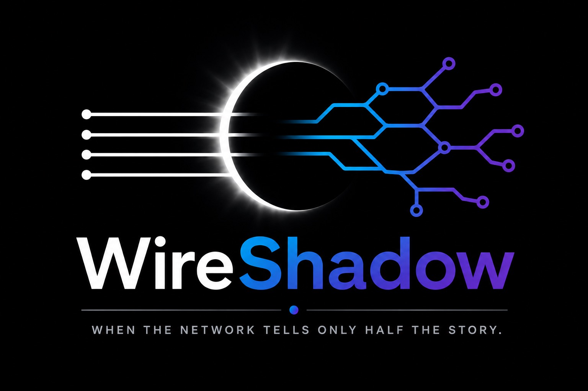
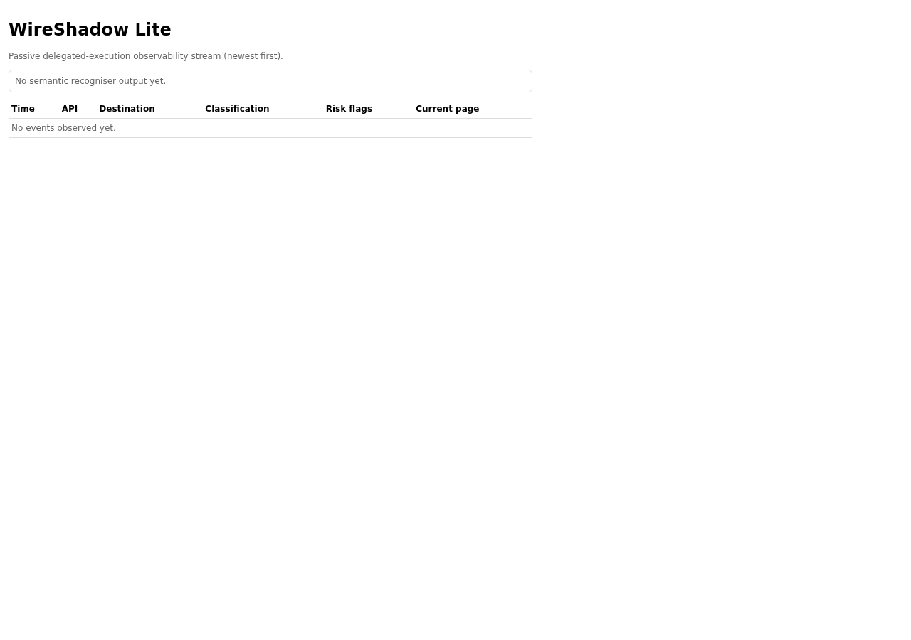
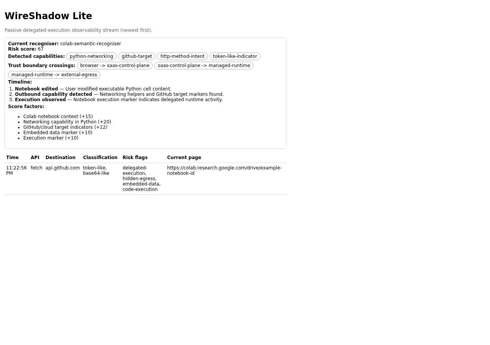

# WireShadow



WireShadow is a browser security and research tool focused on surfacing delegated execution intent and hidden egress risk that ordinary browser network tooling cannot explain.

## Why Google Colab first

Google Colab is a clear delegated-execution scenario: users author and run Python notebooks in-browser, but execution is delegated to Google-managed runtime infrastructure. Browser tooling shows the control-plane interaction with Colab, not the full downstream runtime network behavior.

## Why browser network inspection is insufficient

In SaaS notebook platforms (for example Google Colab), enterprise controls can observe trusted browser traffic to the platform while missing downstream runtime egress performed by remotely executed notebook code. WireShadow highlights the semantic chain:

1. browser-side intent
2. delegated runtime execution
3. potential off-endpoint outbound egress

WireShadow now includes a first Colab semantic recogniser that emits:

- delegated execution events
- deterministic trust-boundary timelines
- lightweight additive risk scoring with explicit factors
- detected outbound capability classes (networking libraries, external execution helpers, GitHub/cloud targets)

## SPADE origin and Colab poster-child scenario

SPADE means **Side-channel Platform Abuse and Data Exfiltration**.

Initial focus:

- user edits notebook content with data + executable Python
- notebook code includes outbound mechanisms (`requests`, `urllib`, `httpx`, `curl`, `wget`, GitHub APIs)
- execution occurs in provider-managed runtime outside enterprise endpoint visibility

WireShadow Lite makes intent and risk markers visible without extracting secrets.

## Delegated execution model (current implementation)

The recogniser emits a generic `DelegatedExecutionEvent` containing:

- execution platform
- confidence
- trigger
- execution language
- outbound capability detected
- embedded data detected
- trust boundary crossed

This model is intentionally generic for future recognisers.

## Trust Boundary Timeline (current implementation)

WireShadow builds structured timeline steps from deterministic recogniser signals. Example sequence:

1. user edited notebook
2. python networking capability detected
3. embedded data detected
4. notebook execution observed
5. execution delegated to Google infrastructure
6. potential downstream network activity outside browser visibility

No AI summarisation is used in this phase.

## Lite vs Pro

### WireShadow Lite (MVP)

Chromium MV3 extension with metadata-only observation pipeline:

- page-world instrumentation for `fetch`, XHR, `sendBeacon`, WebSocket, EventSource
- typed page -> content -> background message contracts
- background in-memory event store with multi-tab support
- popup UI view over newest-first observed events
- popup semantic view for recogniser, timeline, score, capabilities, and trust-boundary crossings
- additive payload classification (no raw payload retention)
- safe redaction evidence (category, length, SHA-256 hash, limited safe evidence)
- Google Colab SPADE recogniser findings

### WireShadow Pro (future, documented only)

Potential CDP-backed capabilities:

- request/response inspection
- call stacks and source maps
- dynamic script and service-worker tracing
- storage/DOM mutation tracking
- execution timelines and causal graphs

## Safety model

- classify and redact by default
- never retain full secret material
- retain category, length, hash, and minimal safe evidence only
- no offensive automation
- no credential theft behavior
- no data exfiltration implementation

## Current architecture

```text
Page World
   |
Content Script (typed bridge)
   |
Background Service Worker (authoritative typed event store)
   |
View Models
   |
Popup panel (current PR)
DevTools panel (future PR)
```

## Playwright UI screenshots

The screenshots below are generated with a Playwright-driven mock runtime response so the popup renders deterministic semantic states.

### 1. Empty stream baseline



This view documents the passive baseline before any observed events: no recogniser output, no timeline, and no risk factors.

### 2. Colab delegated-execution signal state



This view demonstrates the intended operator-facing explanation path:

- recogniser identity and additive risk score
- detected capability chips and trust-boundary crossings
- timeline steps that explain browser intent vs delegated runtime risk
- explicit score factors used to keep the output deterministic and reviewable

## Current limitations

- in-memory storage only (no persistence/export)
- popup-only UI (no dedicated DevTools panel yet)
- no filtering/search in UI yet
- classification is pattern-based and intentionally lightweight
- no CDP runtime capture in Lite mode

## Roadmap (next increments)

- dedicated DevTools analysis panel on same background event stream
- filtering and timeline interactions
- future recognisers beyond Colab using the same delegated-execution event model
- richer scoring and timeline interactions
- optional persisted local session snapshots
- WireShadow Pro CDP-assisted deep analysis path (future)

## Build and test

```bash
npm install
npm run build
npm test
```

## Load unpacked extension (developer mode)

1. Run `npm run build`.
2. Open `chrome://extensions`.
3. Enable Developer Mode.
4. Select **Load unpacked**.
5. Choose the project root and point to the generated extension assets as required by your local bundling flow.

This bootstrap is intentionally lightweight and is a foundation for follow-on implementation.
