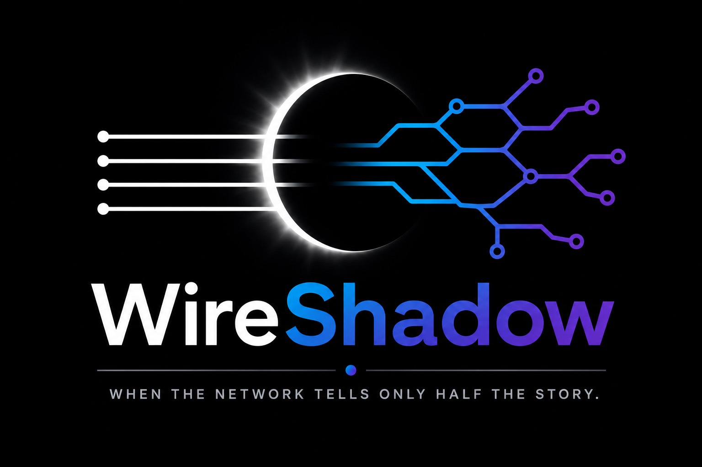
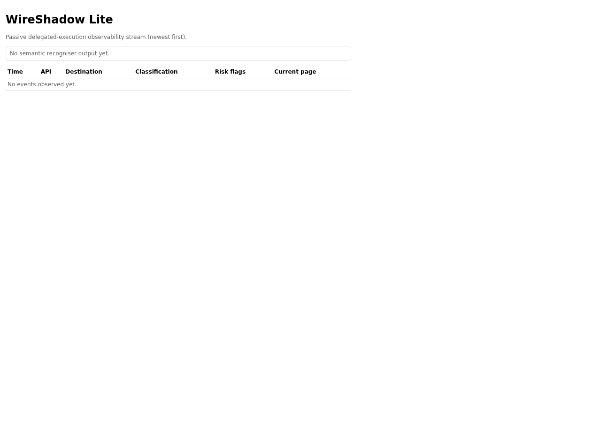
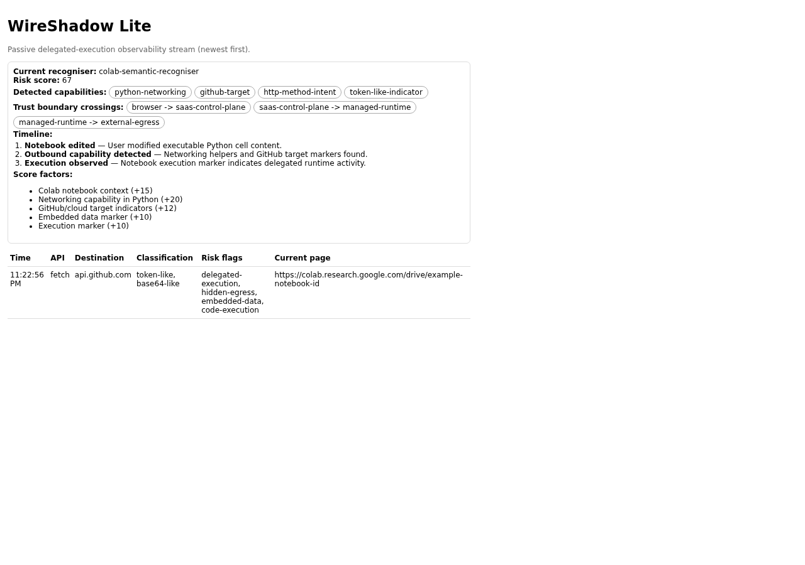

# WireShadow



WireShadow is a browser security and research tool focused on surfacing delegated execution intent and hidden egress risk that ordinary browser network tooling cannot explain.

## Why Google Colab first

Google Colab is a clear delegated-execution scenario: users author and run Python notebooks in-browser, but execution is delegated to Google-managed runtime infrastructure. Browser tooling shows the control-plane interaction with Colab, not the full downstream runtime network behavior.

The same SPADE trust-boundary problem is not Colab-specific. WireShadow now
recognises standards-based Jupyter execution on validated Google Colab and
Kaggle runtime hosts, while keeping unknown deployments explicitly unattributed.

## Why browser network inspection is insufficient

In SaaS notebook platforms (for example Google Colab), enterprise controls can observe trusted browser traffic to the platform while missing downstream runtime egress performed by remotely executed notebook code. WireShadow highlights the semantic chain:

1. browser-side intent
2. delegated runtime execution
3. potential off-endpoint outbound egress

WireShadow now includes a first Colab semantic recogniser that emits:

- delegated execution events
- deterministic trust-boundary timelines
- lightweight additive risk scoring with explicit factors
- detected outbound capability classes (networking libraries, external execution helpers, GitHub/cloud targets)

Delegated execution intent is recognised from outbound Jupyter WebSocket
`execute_request` frames on validated SaaS kernel channels. Colab LSP WebSocket
messages remain notebook-content/edit signals only.

WireShadow now also performs **session-scoped semantic correlation** because notebook meaning can be distributed across time (for example: function defined in one cell, invoked in a later cell). The semantic layer correlates:

- symbols defined earlier (imports, aliases, function definitions, assignments)
- symbols invoked now
- argument provenance (token-like, embedded-data, repository/path classes)
- inherited capability classes and destination classes
- function-definition metadata across single-line, decorated, and multiline signatures (`def` / `async def`)

All retained semantic state is bounded, expiring, and key-scoped with hashed runtime context identifiers (tab + notebook + kernel).

WebSocket processing order is now explicitly split:

1. complete bounded frame decode/parsing for semantic analysis
2. immediate semantic extraction/redaction
3. raw frame/code discard
4. separate truncated display sample for low-level telemetry UI

Display truncation does not drive semantic analysis.

## SPADE origin and Colab poster-child scenario

SPADE means **Side-channel Platform Abuse and Data Exfiltration**.

Initial focus:

- user edits notebook content with data + executable Python
- notebook code includes outbound mechanisms (`requests`, `urllib`, `httpx`, `curl`, `wget`, GitHub APIs)
- execution occurs in provider-managed runtime outside enterprise endpoint visibility

WireShadow Lite makes intent and risk markers visible without extracting secrets.

## Delegated execution model (current implementation)

The recogniser emits a generic `DelegatedExecutionEvent` containing:

- execution platform
- confidence
- trigger
- execution language
- outbound capability detected
- embedded data detected
- trust boundary crossed
- downstream activity observed (`unknown` in Lite mode)
- known symbol invoked (when correlated)
- inherited capabilities (when correlated)

This model is intentionally generic for future recognisers.

## Trust Boundary Timeline (current implementation)

WireShadow builds structured timeline steps from deterministic recogniser signals. Example sequence:

1. user edited notebook
2. python networking capability detected
3. embedded data detected
4. notebook execution observed
5. execution delegated to Google infrastructure
6. potential downstream network activity outside browser visibility

No AI summarisation is used in this phase.

## Evidence levels and semantic correlation

WireShadow Lite reports semantic evidence using explicit levels:

- `observed` (directly seen browser/protocol signal)
- `correlated` (resolved from prior observed semantic state)
- `inferred` (runtime potential based on correlated capabilities)
- `unknown` (not directly observable in Lite mode)

Example:

1. observed: Jupyter execute_request
2. correlated: earlier function definition resolved at call site
3. correlated: token-like / embedded-data argument supplied
4. inferred: managed runtime may perform outbound write
5. unknown: downstream request success

WireShadow Lite can infer delegated egress potential from browser-observed protocol and code semantics, but it does **not** claim direct observation of managed-runtime downstream network traffic.

## Generic vs service-specific recognisers

Reusable logic (Python import/definition/assignment/call analysis, symbol capability mapping, argument provenance, correlation, evidence modeling) lives in shared core semantic layers.

Platform recognisers retain only validated host attribution and
platform-specific transport quirks. Current explicit attributions are
`google-colab` and `kaggle-notebooks`; arbitrary Jupyter-like hosts remain
`unknown` and do not produce execution findings.

## Lite vs Pro

### WireShadow Lite (MVP)

Chromium MV3 extension with metadata-only observation pipeline:

- page-world instrumentation for `fetch`, XHR, `sendBeacon`, WebSocket, EventSource
- typed page -> content -> background message contracts
- background in-memory event store with multi-tab support
- popup UI view over newest-first observed events
- popup semantic view for recogniser, timeline, score, capabilities, trust-boundary crossings, latest execution, and latest egress-indicating execution
- additive payload classification (no raw payload retention)
- safe redaction evidence (category, length, SHA-256 hash, limited safe evidence)
- Google Colab and Kaggle Jupyter SPADE recogniser findings

### WireShadow Pro (future, documented only)

Potential CDP-backed capabilities:

- request/response inspection
- call stacks and source maps
- dynamic script and service-worker tracing
- storage/DOM mutation tracking
- execution timelines and causal graphs

## Safety model

- classify and redact by default
- never retain full secret material
- retain category, length, hash, and minimal safe evidence only
- no offensive automation
- no credential theft behavior
- no data exfiltration implementation

## Current architecture

```text
Page World
   |
Content Script (typed bridge)
   |
Background Service Worker (authoritative typed event store)
   |
View Models
   |
Popup panel (current PR)
DevTools panel (future PR)
```

## Playwright UI screenshots

The screenshots below are generated with a Playwright-driven mock runtime response so the popup renders deterministic semantic states.

### 1. Empty stream baseline



This view documents the passive baseline before any observed events: no recogniser output, no timeline, and no risk factors.

### 2. Colab delegated-execution signal state



This view demonstrates the intended operator-facing explanation path:

- recogniser identity and additive risk score
- detected capability chips and trust-boundary crossings
- timeline steps that explain browser intent vs delegated runtime risk
- explicit score factors used to keep the output deterministic and reviewable

### Browser test evidence

Playwright E2E runs retain screenshots for every asserted panel state:

- [instrumentation/fetch smoke state](./docs/test-evidence/extension-smoke-fetch.png)
- [Kaggle delegated-execution state](./docs/test-evidence/kaggle-delegated-execution.png)

The Kaggle fixture uses a local WebSocket server mapped to a validated Kaggle
host. It proves browser-to-extension observation, platform attribution,
redaction, and hidden-egress risk semantics; it does not claim provider-side
egress was directly observed.

## Current limitations

- in-memory storage only (no persistence/export)
- popup-only UI (no dedicated DevTools panel yet)
- no filtering/search in UI yet
- classification is pattern-based and intentionally lightweight
- no CDP runtime capture in Lite mode
- SaaS host/protocol mappings can change and require field revalidation

## Roadmap (next increments)

- dedicated DevTools analysis panel on same background event stream
- filtering and timeline interactions
- future recognisers beyond Colab using the same delegated-execution event model
- richer scoring and timeline interactions
- optional persisted local session snapshots
- WireShadow Pro CDP-assisted deep analysis path (future)

## Build and test

```bash
npm install
npm run build
npm test
```

`npm run build` now performs TypeScript type-checking (`--noEmit`) and bundles extension runtime entry points via esbuild into a self-contained unpacked extension at `dist/extension`.

Browser-level extension pipeline integration test (required for browser-facing changes):

```powershell
$env:WIRESHADOW_E2E=1
npm test
```

Canonical ARM64 container run (Docker requires `sudo` on the tested host):

```bash
sudo docker run --rm --platform linux/arm64 --user 1000:1000 \
  -e HOME=/tmp/wireshadow-playwright-home -e WIRESHADOW_E2E=1 \
  -v "$PWD:/work" -w /work \
  mcr.microsoft.com/playwright:v1.61.1-noble \
  sh -lc 'mkdir -p /tmp/wireshadow-playwright-home && xvfb-run -a npm test'
```

The Playwright image version must match the version resolved in
`package-lock.json`. Successful E2E handoff includes the retained files under
`docs/test-evidence/`.

## Load unpacked extension (developer mode)

1. Run `npm run build`.
2. Open `chrome://extensions` (or `edge://extensions`).
3. Enable Developer Mode.
4. Select **Load unpacked**.
5. Choose `dist/extension` from this repository.

This bootstrap is intentionally lightweight and is a foundation for follow-on implementation.

The popup now includes a compact sensor status card so an empty event table is distinguishable from instrumentation or bridge failures.
